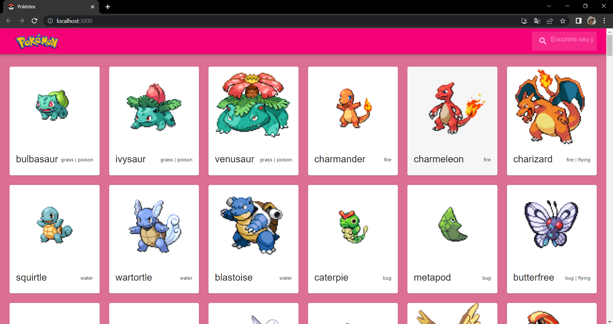

Projeto Pokedex em React.JS

Listei apenas uma parte dos Pokemons. A lista é enorme mas para demostrar a criação da pokedex acredito ser o suficiente.
Fiz o projeto, voltado para as meninas, pois quando o Pokemon, começou a passar no Brasil, eu tinha 12 anos e era a unica menina a ter o album e trocar figurinhas com os meninos, pois era visto como desenho para eles. Utilizei React.Js, React Router, JavaSpript assincrono, PokeApi, Mui e Axios.

Foi utilizado o Framework React.Js

https://pokedex-theta-blond-98.vercel.app/
